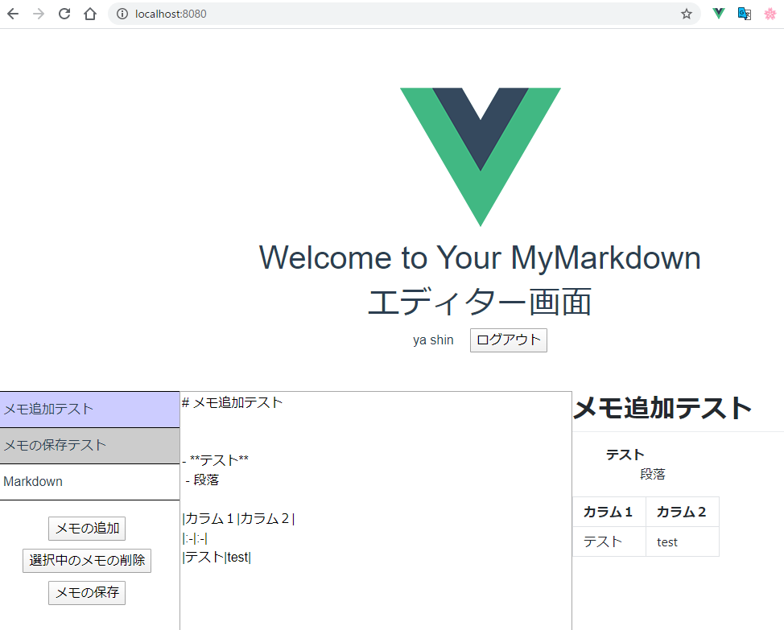

# Vue.jsでマークダウンエディタを作成

Vue.js　と　Firebaseでマークダウンエディタを構築
[FirebaseURL](https://mymarkdown-ddf75.web.app)



ログインはGoogleアカウントでログインできるように設定。


## Firebaseの登録、設定
https://console.firebase.google.com/
からプロジェクトを追加し、ウェブアプリにFirebaseを追加。
apiキーの情報を設定する。
Google認証やDBを使う場合は、Firebase JS SDKのスクリプトに両方も追加しておく必要がある。
```html
  <!-- The core Firebase JS SDK is always required and must be listed first -->
  <script src="https://www.gstatic.com/firebasejs/7.14.2/firebase-app.js"></script>
  <script src="https://www.gstatic.com/firebasejs/7.14.2/firebase-auth.js"></script>
  <script src="https://www.gstatic.com/firebasejs/7.14.2/firebase-database.js"></script>
```
Hostingメニューをクリックし、開始。
端末に`npm install -g firebase-tools`　　
プロジェクトフォルダに移動しておく。
`firebase login`
`firebase init`
次に進むか聞かれるので、Yにし、
Hosting をカーソルで選択してスペース。
既存のProjectを使うで選択、プロジェクト名を選択。
公開に利用するディレクトリ名はdistと入力する
index.htmlだけを公開しないので、そのままエンター（No）

各種パスが開発用のままなので、修正
```javascript:webpack.config.js
  devServer: {
    contentBase: 'dist', // 追加
    historyApiFallback: true,
    noInfo: true,
    overlay: true
  },
      sourceMap: false,
```
Firebase無料枠はアップロード容量制限があるので、SourceMapがtrueの場合mapファイルで容量オーバーの可能性があるためオフにする。

Firebaseへリリースするには`firebase deploy` を実行する。

## 実装時エラー
マークダウンをHTMLに変換してプレビューするためのmarkedライブラリをインストール。
markedのバージョンが1.0.0になっているとbuild時にエラーが発生する。
> ERROR in build.js from UglifyJs
> Unexpected token: punc (,) [build.js:98,13]
解決方法として、markedのバージョンを0.7.0にして解決。

